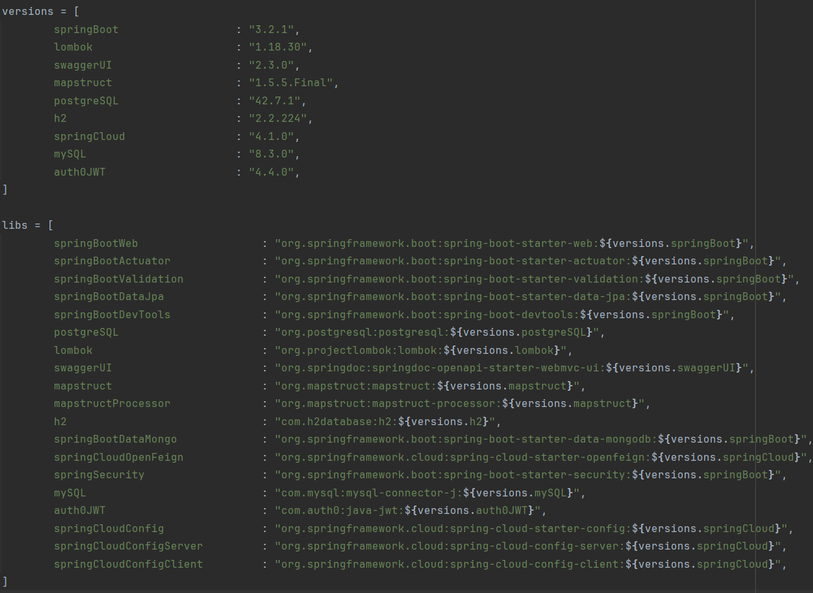
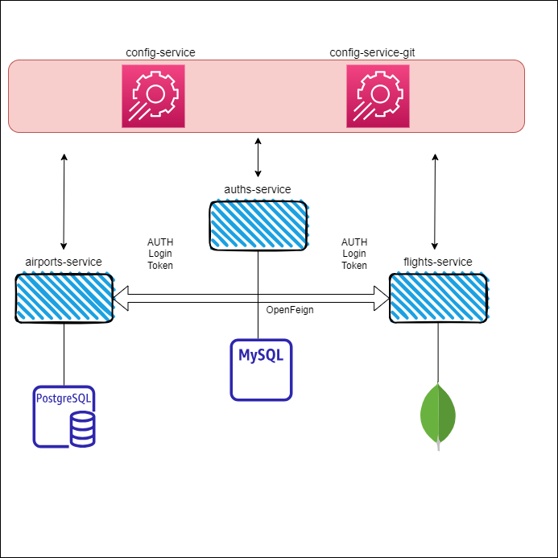

# Amadeus Flight Search Api

The primary objectives of this project are to manage operations related to airports through the airports service and handle flights using the flight service, both secured by JWT authentication. The flight service also consumes data from an external flights API, leveraging a scheduled task for updates. Furthermore, it enhances the user experience by offering advanced search capabilities for flights.
## Table of Contents
<!-- TOC -->
  * [Table of Contents](#table-of-contents)
  * [Introduction](#introduction)
  * [Technologies](#technologies)
    * [Why microservice architecture?](#why-microservice-architecture)
  * [Features](#features)
    * [Rest Api](#rest-api)
    * [Exception messages list](#exception-messages-list)
      * [Auth service exception](#auth-service-exception)
      * [Airport service exception](#airport-service-exception)
      * [Flight service exception](#flight-service-exception)
  * [Install](#install)
  * [Locally](#locally)
    * [Prerequisites](#prerequisites)
    * [Installation](#installation)
  * [On docker](#on-docker)
  * [Contact](#contact)
<!-- TOC -->
## Introduction
There are five distinct microservices in the system. Among them, two serve as configuration services. One of config-service, config-server, allows the utilization of local configurations to run the project.

The third service is the auth-service, where I have implemented JWT token authentication and configured Spring Security for enhanced security.

The remaining two services are the flights-service and airports-service. These services enable registered users to organize flights and airports through operations such as create, update, and delete. Access to GET requests on these services is open to everyone.

## Technologies
* Java 17
* Spring framework and relation sub-technologies(OpenFeign, Security, Cloud, Jpa etc.)
* Gradle
* JWT
* Lombok
* Docker
* Cloud Native Buildpack
* Mapstruct for mapping
* MySQL in Auth Service
* PostgreSQL in Airport Service
* MongoDB in Flight Service
* Swagger Open Api

### Why microservice architecture?
I have preferred microservice architecture because further operations and adopting new technologies and framework can be handled decoupled way.

Dependencies and their versions:

## Features

Let's take a brief look at the APIs:

### Rest Api
* Auths Service
  
| Request Type | Api operation | Return Token | Token Required |
|:------------:|:-------------:|:------------:|:--------------:|
|     POST     |   register    |              |                |
|     POST     |     login     |     yes      |                |

* Airports Service

| Request Type | Api operation  | Return Token |      Token Required       |
|:------------:|:--------------:|:-------------|:-------------------------:|
|     POST     |     create     |              |            yes            |
|     PUT      |     update     |              |            yes            |
|    DELETE    |     delete     |              |            yes            |
|     GET      |   fetchbyid    |              |                           |
|     GET      |    fetchall    |              |                           |
|     GET      | hasfoundbyname |              |                           |

* Flights Service

  This service also periodically consumes APIs from an external source using a scheduled task.

  My external mock api: https://6c9dc3d8-cc13-431f-a11c-611b8af5e7fe.mock.pstmn.io/amadeus/flights
  
| Request Type | Api operation | Return Token |  Token Required  |
|:------------:|:-------------:|:------------:|:----------------:|
|     POST     |    create     |              |       yes        |
|     POST     | searchflight  |              |                  |
|     PUT      |    update     |              |       yes        |
|    DELETE    |    delete     |              |       yes        |
|     GET      |   fetchbyid   |              |                  |
|     GET      |   fetchall    |              |                  |

_Note: For detailed view you can use open api doc._

My basic presentation of the architecture:

Let's take a brief look at the Exception messages:
### Exception messages list

    X   X   X   X
    |   |   |   |
    |   |   |   +-----> Message
    |   |   +---------> Sub process code
    |   +-------------> Service name
    +-----------------> Process
    1   0   0   0 -> Process error
    3   0   0   0 -> Authentication error
    4   0   0   0 -> Json parameter error
    5   0   0   0 -> Server error

#### Auth service exception
    5000: INTERNAL_ERROR - An unexpected error on the server
    4011: BAD_REQUEST - Parameter error
    3022: REGISTER_PASSWORD_ERROR - Retry-password and password must be equal
    3033: REGISTERED_USER_ERROR - E-mail has already registered
    3044: LOGIN_ERROR - Email or password is incorrect
    3055: JWT_TOKEN_CREATE_ERROR - Token error

#### Airport service exception
    5100: INTERNAL_ERROR - An unexpected error on the server
    4111: BAD_REQUEST - Parameter error
    1122: CREATE_AIRPORT_ERROR - This airport have been already created
    1133: AIRPORT_NOT_FOUND_ERROR - Airport could not find with giving id
    1144: AIRPORT_NOT_FOUND_NAME_ERROR - Airport could not find with giving name
    3155: INVALID_TOKEN - Token is invalid

#### Flight service exception
    5200: INTERNAL_ERROR - An unexpected error on the server
    4211: BAD_REQUEST - Parameter error
    1222: CREATE_FLIGHT_ERROR - Given airports name cannot find. Check names
    1233: FLIGHT_NOT_FOUND_ERROR - Flight could not find with giving string id
    1244: UPDATE_SAME_AIRPORTS_ERROR - Giving airports' names must not be same
    3255: INVALID_TOKEN - Token is invalid

## Install

You can install the project locally on your computer, or alternatively, utilize my docker-compose.yml file to run it on Docker. I will provide step-by-step instructions, but I recommend using the Docker Hub images that I have prepared.

Nevertheless, if you prefer to run the project on your local system, there are certain prerequisites that need to be met.

Feel free to ask if you have any further questions or if there's anything else I can assist you with!
## Locally

### Prerequisites
* Java 17

* Gradle

* Required postgreSQL on port 5432, with the database username set to 'postgres,' password as 'root,' and the database named 'AirportsDB.' Optionally, you can modify this configuration inside the 'airport-service-dev.yml' file within the config-repo on the config-server.

* Required MySQL on port 3306, with the database username set to 'mysql,' password as 'root,' and the database named 'AuthsDB.' If desired, you can change this configuration inside the 'auth-service-dev.yml' file within the config-repo on the config-server.

* MongoDB on port 27017, with the database username set to 'root,' password as 'root,' and the database named 'FlightDB.' Alternatively, you can adjust this configuration inside the 'flight-service-dev.yml' file within the config-repo on the config-server.

### Installation
1. After completing the prerequisites, start by downloading the repository to your local machine.
2. Next, ensure that ports 8080, 8081, 8082, and 8888 are available.
3. Then, run the services in the following order: config-server, auths-service, airports-service, and flights-service.
4. To perform operations, register through the auths-service http://localhost:8080/swagger-ui/index.html#/, and then log in using your email and password at to get your JWT Token.
   Finally, if desired, you can monitor and interact with other APIs using Swagger at http://localhost:8081/swagger-ui/index.html#/ and http://localhost:8082/swagger-ui/index.html#/ .

## On docker
1. Ensure that ports 3306, 5432, 8080, 8081, 8082, 8888, and 27017 are available.
2. Download the [docker-compose.yml](docker-compose.yml) and the [docker-common-config.yml](docker-common-config.yml) file on your local.
3. Ensure that the Docker is running on your local machine.
4. Navigate to the directory containing the docker-compose.yml and the docker-common-config.yml file and open PowerShell.
5. Type the command `docker-compose up -d` in PowerShell and press Enter.
6. Wait 30 seconds for running all of container
7. To perform operations, register through the auth-service http://localhost:8080/swagger-ui/index.html#/, and then log in using your email and password to get your JWT Token.
   Finally, if desired, you can monitor and interact with other APIs using Swagger at http://localhost:8081/swagger-ui/index.html#/ and http://localhost:8082/swagger-ui/index.html#/ .

## Contact

If you have trouble and some questions you can reach me using this e-mail address : upfront-seek0b@icloud.com